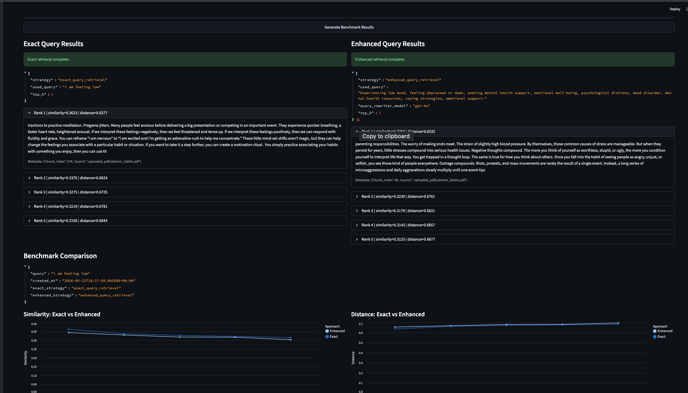

# 
# AIRS — AI Intelligent Retrieval System

Local semantic retrieval project that compares two strategies:

- **Exact retrieval**: direct vector search on the original query.
- **Enhanced retrieval**: query rewritten by `gpt-4o`, then vector search.

Documents are chunked, embedded with `sentence-transformers/all-MiniLM-L6-v2`, and stored in ChromaDB (cosine space).

## Tech Stack

- Python + FastAPI + Streamlit
- ChromaDB
- SentenceTransformers (`all-MiniLM-L6-v2`)
- OpenAI API (`gpt-4o`) for query enhancement

## Project Files

- `RAG.py` — PDF extraction, chunking, embedding, and vector storage
- `retrieval.py` — exact/enhanced retrieval + benchmark metadata JSON
- `backend_api.py` — API endpoints (`/upload`, `/retrieve/exact`, `/retrieve/enhanced`, `/benchmark`)
- `frontend.py` — Streamlit UI for upload, retrieval, and benchmark charts

## Setup

Use Python `3.12` (recommended).

```zsh
python3.12 -m venv .venv
source .venv/bin/activate
pip install -r requirements.txt
```

Add your OpenAI key in `.env`:

```env
OPENAI_API_KEY=your_key_here
```

## Run

Start backend:

```zsh
uvicorn backend_api:app --reload --host 127.0.0.1 --port 8000
```

Start frontend (new terminal):

```zsh
streamlit run frontend.py --server.address 127.0.0.1 --server.port 8501
```

Open `http://127.0.0.1:8501`.

## Usage

1. Upload a PDF in the frontend.
2. Run **Exact Query Search** and **Enhanced Query Search**.
3. Click **Generate Benchmark Results** to build comparison data.
4. View similarity and distance charts for both approaches.

## Notes

- If OpenAI is unavailable, enhanced retrieval may fall back to the original query.
- Chroma persistence directory is `./chroma_db`.


streamlit run frontend.py --server.address 127.0.0.1 --server.port 8501

uvicorn backend_api:app --reload --host 127.0.0.1 --port 8000